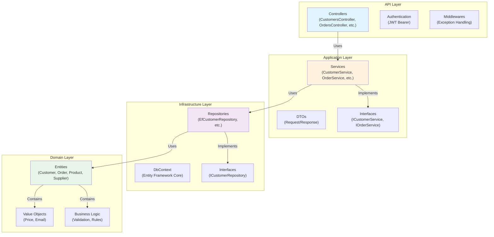
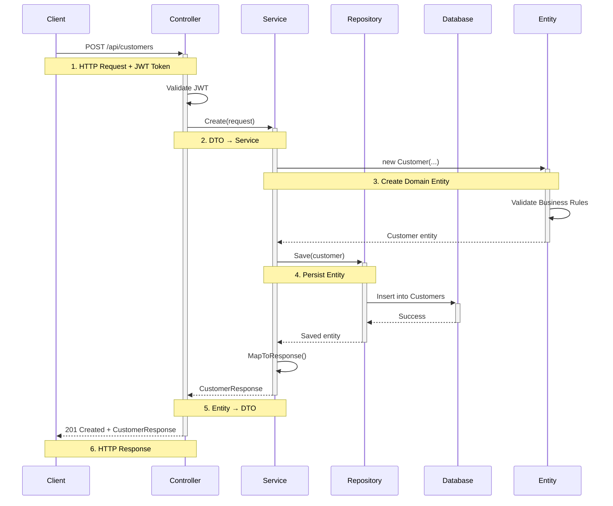
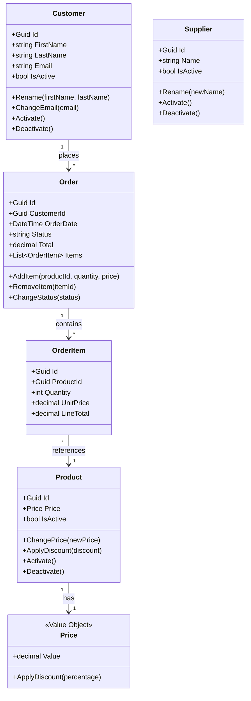
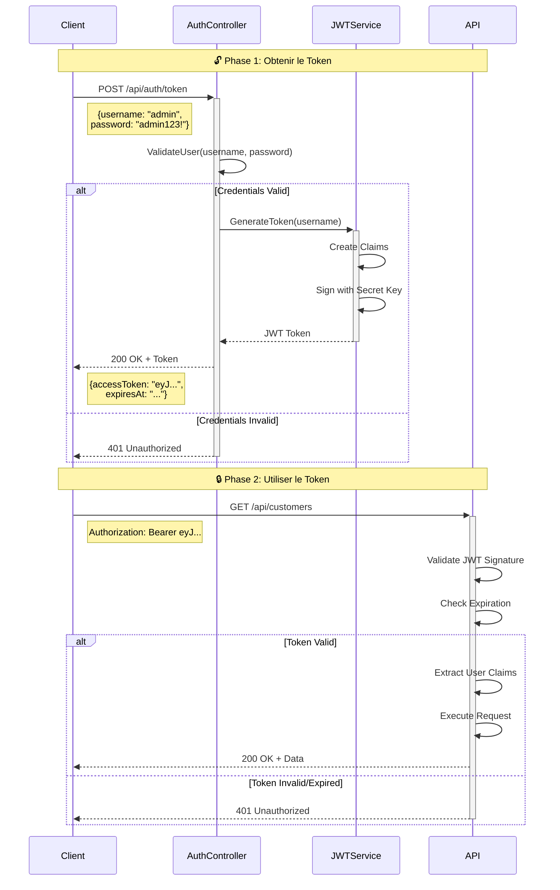
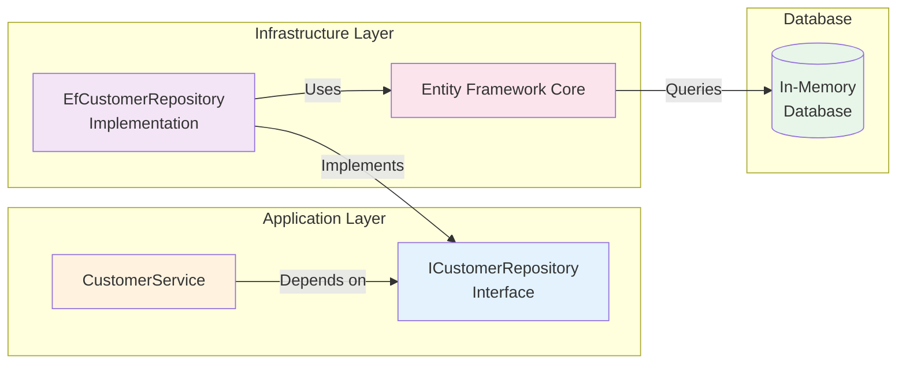
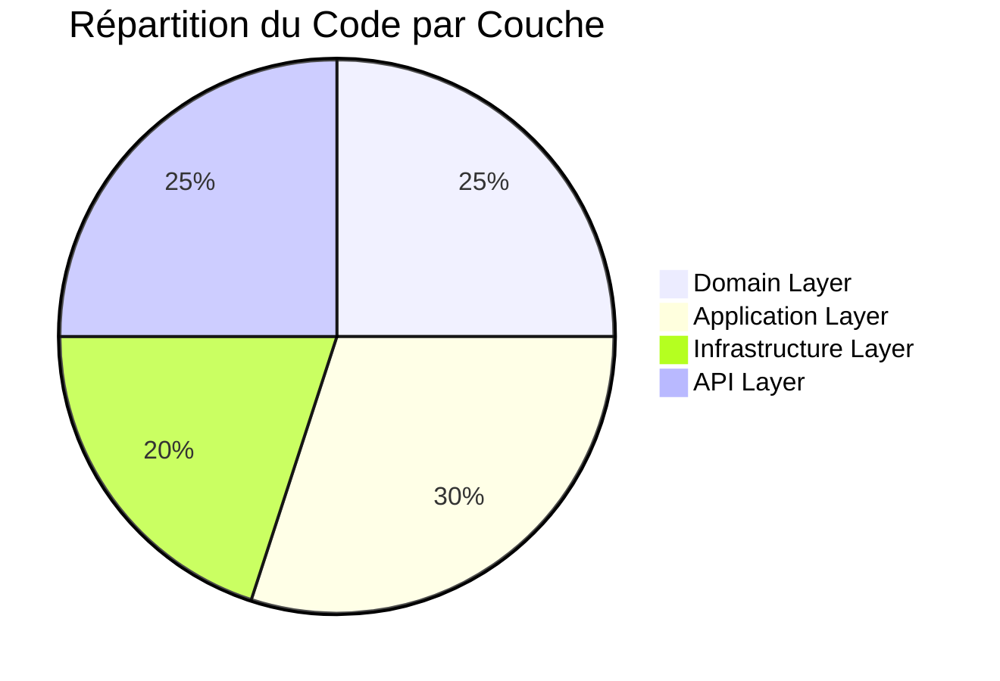
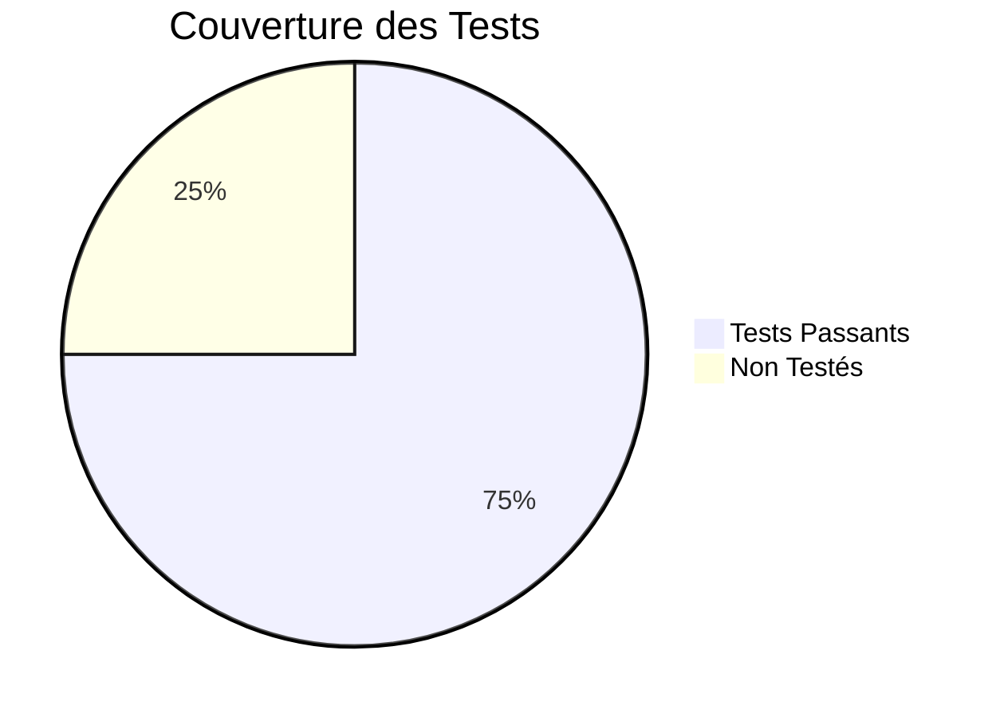
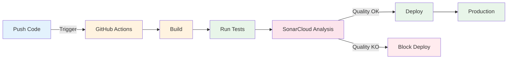

# Diagrammes de l'Architecture

Cette page présente les diagrammes visuels pour mieux comprendre l'architecture et les flux de l'application.

## 🏗️ Architecture en Couches (Clean Architecture)

Ce diagramme montre comment les différentes couches de l'application sont organisées selon les principes de Clean Architecture.

### 📝 Explication

- **API Layer** (Bleu): Point d'entrée de l'application, gère les requêtes HTTP
- **Application Layer** (Orange): Orchestration de la logique métier, coordination
- **Infrastructure Layer** (Violet): Accès aux données, persistence
- **Domain Layer** (Vert): Cœur de l'application, logique métier pure

---

## 🔄 Flux d'une Requête HTTP

Ce diagramme montre le chemin complet d'une requête API depuis le client jusqu'à la base de données.

### 📝 Étapes du Flux

1. **Réception**: Le controller reçoit la requête et valide le JWT
2. **Orchestration**: Le service coordonne l'opération
3. **Validation**: L'entité du domaine valide les règles métier
4. **Persistence**: Le repository sauvegarde dans la DB
5. **Mapping**: Conversion de l'entité vers un DTO
6. **Réponse**: Retour au client avec le résultat

---

## 🗄️ Structure de la Couche Domain

Ce diagramme montre les entités principales et leurs relations.

### 📝 Relations Métier

- Un **Customer** peut passer plusieurs **Orders**
- Une **Order** contient plusieurs **OrderItems**
- Chaque **OrderItem** référence un **Product**
- Chaque **Product** a un **Price** (Value Object)
- Les **Suppliers** sont indépendants (pas de relation directe)

---

## 🔐 Flux d'Authentification JWT

Ce diagramme explique comment fonctionne l'authentification JWT dans l'application.

### 📝 Sécurité JWT

- **Phase 1**: L'utilisateur s'authentifie et reçoit un token JWT
- **Phase 2**: Chaque requête utilise ce token dans le header Authorization
- Le token expire après **60 minutes**
- Le token est signé avec une clé secrète côté serveur

---

## 🎯 Pattern Repository

Ce diagramme montre comment le pattern Repository abstrait l'accès aux données.

### 📝 Avantages du Pattern Repository

✅ **Abstraction**: Le service ne connaît pas la technologie de persistence
✅ **Testabilité**: Facile de créer des mocks pour les tests
✅ **Flexibilité**: Peut changer EF Core pour Dapper sans modifier les services
✅ **SOLID**: Respect du principe d'inversion de dépendances (DIP)

---

## 📊 Statistiques du Projet

---

## 🚀 Déploiement CI/CD

Ce diagramme montre le pipeline de déploiement avec GitHub Actions.

### 📝 Pipeline CI/CD

1. **Build**: Compilation du projet .NET
2. **Test**: Exécution des 15 tests automatisés
3. **SonarCloud**: Analyse de qualité et sécurité du code
4. **Deploy**: Déploiement automatique si tout est vert

---

## 📖 Retour à la documentation

- [Accueil](index.md)
- [Architecture détaillée](architecture.md)
- [Guide API](api-guide.md)
